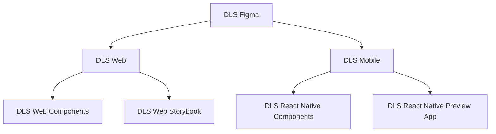

## Business Context

**What was the product?** The Design Language System (DLS) is Singtel's design framework and companion component library
serving web and mobile platforms (React-Native), serving as the single source of truth for UI/UX across all consumer-facing
digital products - the main eShop website, and mobile applications.

**Who were the users?** Two distinct groups: end consumers interacting with Singtel's digital storefronts, and internal
engineering and product teams using DLS as a platform dependency. In a design system, the developer experience of the
second group directly determines the quality and consistency delivered to the first.

**What problem did it solve?** Before DLS, each product team maintained its own component implementations. This led to
visual inconsistency, duplicated effort, diverging accessibility standards, and a slow feedback loop between design and
engineering. Designers created assets that engineering teams re-implemented differently, sometimes multiple times. DLS
centralized this into a single, versioned, well-documented library.

**Scale:** DLS underpins all Singtel consumer-facing digital properties — spanning millions of users across Singapore's
primary telco digital channels. Internally, it serves multiple product teams shipping changes on continuous delivery
cycles.

---

## Frontend Architecture

### Library Architecture: React + React Native

DLS is structured as two distinct but philosophically aligned libraries: a React library for web and a React Native
library for mobile. This is a deliberate architectural boundary reflects organizational priorities. The libraries are
developed and maintained by different teams, and ran independent release cycles.

DLS Repository



### Design Token Architecture

Design tokens are the foundational layer of DLS: primitive values like colour, spacing, border radius, and typography
scale that flow through both web and native libraries. They are defined in Figma by the design team. A platform-agnostic
(JSON/YAML) configuration is exported to platform-specific outputs: CSS custom properties for web and JavaScript
constants for React Native.

This ensures that when a brand colour changes, it updates in one place and propagates automatically to both platforms
through the build pipeline, instead of requiring manual updates across two libraries.

Component Design Philosophy: Atomic Design + Compound Components

Components are structured following the Atomic Design methodology — Atoms (Button, Input, Icon), Molecules (FormField,
SearchBar), Organisms (NavigationBar, ProductCard). However, for complex components with internal state and
compositional flexibility (e.g., Accordion, Modal, Tabs), DLS uses the Compound Component pattern to expose a composable
API while encapsulating shared state via React Context:

```jsx
// Consumer usage — composable, readable, no prop drilling
<Tabs defaultValue="plans">
  <Tabs.List>
    <Tabs.Trigger value="plans">Plans</Tabs.Trigger>
    <Tabs.Trigger value="devices">Devices</Tabs.Trigger>
  </Tabs.List>
  <Tabs.Panel value="plans">
    <PlansContent />
  </Tabs.Panel>
  <Tabs.Panel value="devices">
    <DevicesContent />
  </Tabs.Panel>
</Tabs>
```

This was chosen over a monolithic props API (`<Tabs tabs={[{label, content}]} />`) because it gives product teams the
flexibility to compose content without being constrained by what the library author anticipated. Heavily inspired by
[Radix UI](https://www.radix-ui.com/)

### Bundling Strategy

DLS web is bundled with Vite/Rollup, producing both ESM and CJS outputs. Webpack was evaluated but Rollup is the clear
choice for library bundling: superior tree-shaking, cleaner output, and better support for the exports field in
package.json for subpath imports. Consumer applications can import individual components
(`import { Button } from '@dls/web/Button'`) rather than the full library, keeping their bundle sizes minimal.

TypeScript declarations are emitted via tsc alongside the Rollup build, ensuring consumers get full type safety and IDE
autocompletion without a separate type-only package.

### How DLS succeeded 🎉

The repository is managed as a polyrepo with web and React Native modules developed and maintained by different teams.
DLS development was democratized, with the DLS core team as the decision-making body responsible for enforcing quality
and standards for each component added to the DLS catalogue. The DLS team published comprehensive guides for component
specifications and usage.

The DLS UX team advocated for DLS components adoption with the product UX teams. As the products rolled down the SDLC
pipeline to the development stage, DLS engineers worked closely with the product engineers to build the DLS component
catalogue. The DLS core engineers act as custodians and advocates for DLS in the company. This way, efforts were
streamlined across both product and DLS teams. With this approach, we were able to get product teams to invest in and
readily adopt DLS. This active participation propelled UI/UX unification across Singtel products.

---

## System Design & Integration

### Versioning and Release Strategy

DLS follows Semantic Versioning with a structured release process:

- Patch: bug fixes, backwards-compatible
- Minor: new components or props, backwards-compatible
- Major: breaking API changes, with a deprecation period and codemods scripts

Major versions were managed carefully — product teams cannot absorb breaking changes on short notice. The release
process includes:

1. An RFC or design review documenting the proposed change and migration path
2. A deprecation period during which the old API still works but emits console warnings
3. A codemods script (where feasible) to automate migration in consumer codebases
4. Coordinated upgrade support, including pairing sessions with product teams

### CI/CD Pipeline

```
Pull Request → Lint + Unit Tests + Storybook Build + Visual Regression Tests
     ↓
Merge to main → Build (tokens → web → native) → Publish to private npm registry
     ↓
Automated Storybook deployment
```

Visual regression testing (via `jest-snapshot-test`) is integrated into the PR pipeline to catch unintentional visual
changes in component rendering — a common failure mode when refactoring shared utilities.

### Consumer Integration Challenges

The hardest integration problem is not building the library — it is adoption. Product teams have existing
implementations, deadlines, and natural resistance to dependency on a shared library they didn't build. My approach was
threefold:

1. Have Product engineers invest in DLS development. This process was enforced early on as a working model in the
   company. As DLS components were built by the same people who actually get to use them, we solved many major problems
   with adoption:
1. Components were built with product requirements in mind.
1. DLS engineers were involved closely to ensure product specific requirement do not creep into the component api.
1. Since product engineers actually built the components, there was no friction during adoption of these components.
1. Embed with product teams. I ran onboarding sessions, attended squad planning meetings to understand their timelines,
   and flagged upcoming breaking changes early so teams could plan upgrades.

---

## Performance Engineering

### Bundle Impact on Consumers

A poorly built design system library can become a major contributor to consumer bundle size. DLS was optimised along
several axes:

- Tree-shaking first: ESM output and proper sideEffects: false in package.json ensure bundlers can eliminate unused
  components entirely.
- Subpath exports: package.json exports map allows granular imports without barrel file overhead.
- CSS-in-JS avoidance: DLS uses CSS custom properties (variables) rather than a runtime CSS-in-JS solution. Runtime
  CSS-in-JS libraries (styled-components, Emotion) add significant runtime cost and complicate SSR hydration. Static CSS
  with tokens scales better and has zero runtime overhead.
- Icon optimisation: SVG icons are exported as React components generated at build time from the design team's SVG
  source files, with SVGO optimisation. Each icon is a separate module — consumers pay only for icons they import.

---

## Technical Challenges & Pain Points

### Challenge 1: Breaking Change Coordination at Scale

**Root cause:** With 5+ product teams consuming DLS across different release cadences, a major version bump creates a
coordination problem. If Team A upgrades to DLS v3 and Team B does not, shared components or design tokens visually
diverge across products — defeating the purpose of a unified design language.

**Why it was difficult:** There is no technical solution that eliminates this entirely — you cannot force teams to
upgrade. The problem is organisational as much as technical.

**How it was solved:** Introduced a Long-Term Support (LTS) policy for major versions, guaranteeing security and
critical bug fixes for a defined period after a major release. This gave teams a safety net to delay upgrades without
risk. Simultaneously, we introduced automated codemods using jscodeshift to reduce the manual effort of migrating API
changes, making upgrades faster and more predictable.

**What I'd do differently:** Start the deprecation and migration conversation six months earlier than feels necessary.
Teams always need more runway than expected.

## Ownership & Leadership

- Authored DLS architecture RFCs covering component API design principles, token taxonomy, and release policy
- Established the visual regression testing workflow using jest-snapshot-testing, reducing unintentional visual
  regressions from a recurring problem to an automated gate
- Led quarterly DLS community of practice sessions — open forums for product team engineers to surface friction, request
  new components, and understand upcoming changes
- Managed the public (internal) DLS changelog and release notes, treating them as a communication product rather than
  just a technical log
- Onboarded and trained engineers across product teams on DLS integration, component contribution, and the token system

---

## Impact

- Consistency: Achieved visual and UX consistency across all Singtel consumer-facing digital properties through a single
  versioned library
- Velocity: Product teams report faster feature delivery by consuming DLS components rather than building from scratch —
  estimated 30–40% reduction in UI implementation time for standard UI patterns
- Quality: Centralised accessibility compliance reduced the surface area for WCAG violations; automated checks catch
  regressions before production
- Engineer experience: Storybook documentation and TypeScript typings reduced the "how do I use this?" questions
  directed at the DLS team, freeing capacity for new component development
