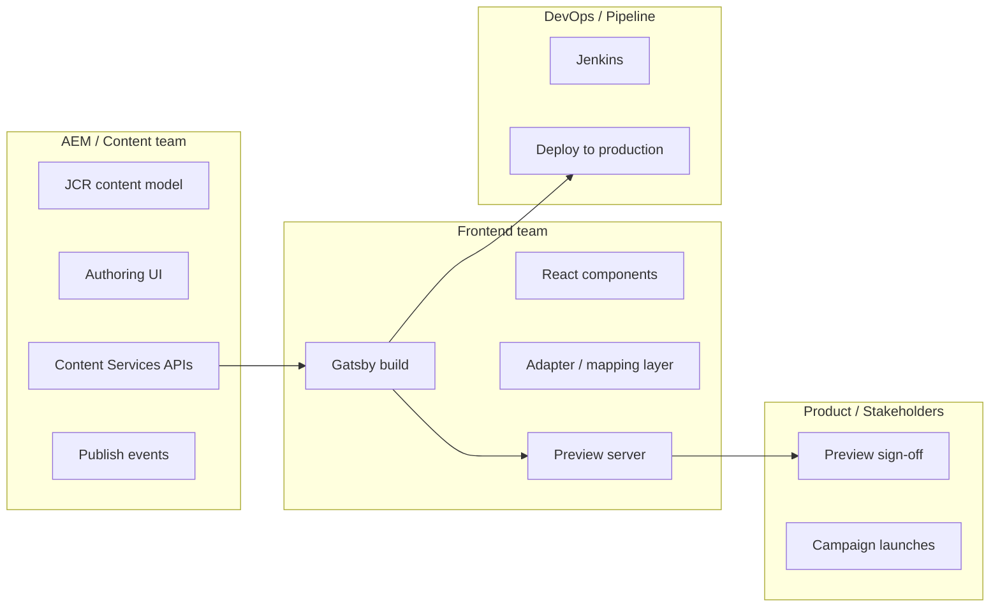

AEM is a powerful CMS. But when our average page load reached nearly 8 seconds and every minor style tweak waited weeks
for release, it became painfully clear: frontend code locked inside HTML templates bleeds speed and agility. The entire
frontend stack is owned and thereby limited by the traditional MVC architecture.

This is the story of how we broke that coupling and replaced it with a Gatsby-based static site generation pipeline,
gathered 3x page load speed improvements. It is also the story of what that actually costs — because decoupling is never
just a technical problem.

---

## The Problem With "It Works"

The original setup worked. That was part of the problem.

AEM's native authoring model, albeit very powerful, encourages you follow the traditional SPA rendering chain where the
templates live inside the AEM package and the frontend bundle hydrates the HTML after the HTML is sent to the client. At
a time when app load times are critical for user retention, this was a huge bottleneck.

The deeper issue: **the frontend team had no independent deploy path**. Every change, no matter how cosmetic, required
coordination with the AEM build and monthly release cycle. This is not a tooling problem. It is an ownership problem
dressed up as a tooling problem.

---

## The Architectural Bet

The approach was straightforward in principle: pull AEM out of the rendering path entirely.

Gatsby would own the build. At deploy time, it pulls content from AEM via its content APIs, generates static HTML, and
pushes the output. AEM shifts focus to what it's good at - serving as a content store with a user-friendly authoring
interface, instead of being a server-side rendering engine that frontend engineers have to negotiate with. For authors,
this approach means they can keep working in the familiar AEM environment, concentrate on content creation, and trust
that their work is delivered quickly and reliably to users without getting tangled in deployment cycles. The end result
is clearer roles, smoother handoffs, and a faster path from content ideation to live site.

A preview server sits alongside this pipeline. Authors can trigger a preview build, inspect the rendered output, and
sign off before anything touches production.

On paper, clean. In practice, three problems immediately surfaced.

---

## Problem 1: AEM's Content Model Is Not Built for React

AEM components are designed around HTL rendering. The content model — the structure of data stored in the JCR — reflects
that. When you start pulling this data as JSON and mapping it into React components, you quickly discover that **what
makes sense for HTL does not map cleanly to props**.

Nested component hierarchies, multi-field widgets, experience fragments, inherited page properties — none of this
arrives at your Gatsby data layer in a shape you'd design if you were starting from scratch. You end up writing a
significant amount of adapter logic that transforms AEM's content model into something your React components can consume
predictably.

This is unglamorous work. It is also load-bearing. Every time the AEM team updated a component's structure — which
admittedly did not happen often but still was a point where the whole house of cards can collapse. The mapping layer had
to be revisited. The interface between the two systems required active maintenance, not just initial setup.

The lesson here is obvious in retrospect: **define the content contract early and in writing, with both teams in the
room**. Without that, you're playing catch-up.

---

## Problem 2: Authors Don't Trust What They Can't See

AEM's native authoring experience gives authors immediate visual feedback. They edit a component, they see the change.
Touch-and-feel authoring. This is one of AEM's genuinely good features.

A Gatsby is not that. It is a separate environment that requires a build step to reflect changes. That build step takes
time. It also requires the author to leave their native environment, navigate to a different URL, and trust that what
they're seeing is an accurate representation of production.

Some authors adapted. Others found the indirection disorienting and pushed back — reasonably so. The question they were
asking was not unreasonable.

The answer — "run a preview build and check the preview server" — is technically correct and experientially inferior to
what they had before. Closing that gap required investment in documentation, in training, and in being present during
early campaign launches to build confidence in the process. It also required being honest that this workflow had a
learning curve, rather than overselling it as seamlessly better.

---

## Problem 3: Latency Is a Feature, Until It Isn't

Static site generation introduces inherent latency between authoring and production. An author publishes content in AEM.
That publish event needs to trigger a Gatsby build. The build runs. The output deploys. Only then is the change live.

On a content-heavy site with a large page inventory, that pipeline is not instantaneous. For most content updates —
evergreen pages, product descriptions, standard campaign assets — this is fine. Nobody is watching a stopwatch.

For time-sensitive content — a flash sale going live at midnight, a price correction, a breaking announcement — the
pipeline latency is suddenly a critical dependency. The question is not whether this will matter. It will. The question
is whether you've had the conversation about it before it matters for the first time at 11:58 PM.

We hadn't, initially. The expectation from some stakeholders was that "publish" meant "live in seconds." Managing that
expectation required going back to square one: what does the content lifecycle actually look like now, step by step, and
what are the realistic time bounds at each stage?

This is a product and process conversation, not an engineering one. Engineering can optimise build times. Engineering
cannot change the fundamental model - at-least for now. (Incremental builds in Gatsby are still experimental and
unstable) If this model doesn't fit a stakeholder's workflow, the right answer is to surface that conflict early — not
to promise a faster build as a workaround.

---

## What Actually Improved

The ten-minute deploy is real. Previously, a typical frontend change waited up to two weeks for the next full AEM
release cycle, with deployment windows often blocked by backend priorities. Now, the same change moves from code to
production in under ten minutes. Frontend changes — styling, component logic, layout updates — no longer depend on an
AEM release. The team can ship independently. That independence compounds over time: fewer blocked deploys, faster
iteration cycles on campaign microsites, and a cleaner separation between "the content team has a problem" and "the
frontend team has a problem."

This was a godsend for the ongoing UI/UX revamp, where new components were being built and tested frequently.

Product owners can review and test changes in the preview environment before campaigns go live. That capability did not
exist before. The friction of the preview workflow is a real cost, but it is a cost paid for something that was not
possible at all under the previous architecture.

---

## What This Was Actually About

Headless AEM is a reasonable technical decision in the right context. But the work of getting there is mostly not
technical.

It is the work of mapping two teams' content model assumptions onto a shared interface. It is the work of redesigning an
authoring workflow that authors did not ask to have redesigned. It is the work of setting accurate expectations about
what "publish" means in a build-based deployment model.

The page load speeds dropped to a few seconds. An easy sell for the product owners, the harder part was convincing folks
using the new system that the tradeoffs were worth it, and then making sure they actually were. This is where most of
the project lived.

---
