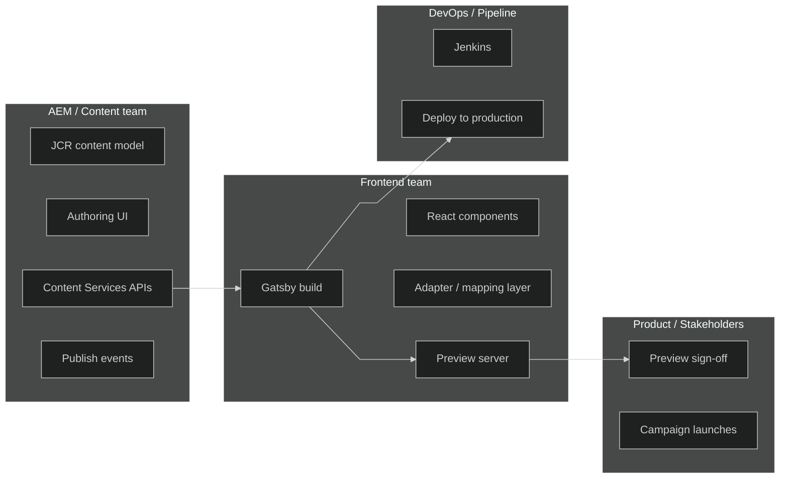

AEM is a powerful CMS. But when our average page load reached nearly 8 seconds and every update - major or minor waited
weeks for release, it became painfully clear that frontend code locked inside HTML templates costs speed and agility.
The frontend stack owned by traditional MVC architecture blocked growth and innovation.

This is how we broke that coupling and replaced it with a Gatsby-based static site generation pipeline, gathered **3x**
page load speed improvements.


```mermaid
%%{ init: {
  "theme": "dark",
  "themeVariables": { "wrap": "false" },
  "flowchart": {
    "curve": "linear",
    "markdownAutoWrap":"false",
    "wrappingWidth": "600"
  }
}}%%
flowchart LR
  subgraph AEM["AEM / Content team"]
    JCR[JCR content model]
    Authoring[Authoring UI]
    ContentAPIs[Content Services APIs]
    Publish[Publish events]
  end

  subgraph Frontend["Frontend team"]
    Gatsby[Gatsby build]
    React[React components]
    Adapter[Adapter / mapping layer]
    Preview[Preview server]
  end

  subgraph Pipeline["DevOps / Pipeline"]
    Jenkins[Jenkins]
    Deploy[Deploy to production]
  end

  subgraph Product["Product / Stakeholders"]
    SignOff[Preview sign-off]
    Campaigns[Campaign launches]
  end

  ContentAPIs --> Gatsby
  Gatsby --> Preview
  Gatsby --> Deploy
  Preview --> SignOff
```

---

## The Problem With "It Works"

The original setup worked. That was part of the problem.

AEM's native authoring model, albeit very powerful, encourages you follow the traditional SPA rendering chain where the
templates live inside the AEM package and the frontend bundle hydrates the HTML after the HTML is sent to the client.
While this works great for highly interactive applications, it is a huge bottleneck for content-heavy static sites,
especially at a time when load times are critical for user retention.

The deeper issue: **the frontend team had no independent deploy path**. Every change, no matter how cosmetic, required
coordination with the AEM build and monthly release cycle. This is not a tooling problem. It is an ownership problem
dressed up as a tooling problem.

---

## The Architectural Bet

The approach was straightforward in principle: pull AEM out of the rendering path entirely. Use AEM for content
management and Gatsby for static site generation.

Gatsby would own the build. At deploy time, it pulls content from AEM via its content APIs, generates static HTML, and
pushes the output. AEM shifts focus to what it's good at - serving as a content store with a user-friendly authoring
interface, instead of being a rendering engine that frontend engineers have to negotiate with. For authors, this
approach means they can keep working in the familiar AEM environment, concentrate on content creation, and trust that
their work is delivered quickly and reliably to users without getting tangled in deployment cycles. The end result is
clearer roles, smoother handoffs, and a faster path from content ideation to live site.

A preview server sits alongside this pipeline. Authors can trigger a preview build, inspect the rendered output, and
sign off before anything touches production.

On paper, clean. In practice, three problems immediately surfaced.

---

## Problem 1: AEM's Content Model Is Not Built for React

AEM components are designed around [HTL rendering](https://itsshahid.com/slings-model-htl-in-aem/). The content model -
the structure of data stored in the JCR - reflects that. When you start pulling this data as JSON and mapping it into
React components, you quickly discover that **what makes sense for HTL does not map cleanly to props**.

Nested component hierarchies, multi-field widgets, experience fragments, inherited page properties - none of this
arrives at your Gatsby data layer in a shape you'd design if you were starting from scratch. You end up writing a
significant amount of adapter logic that transforms AEM's content model into something your React components can consume
predictably.

This is unglamorous work. It is also load-bearing. Every time the AEM team updated a component's structure - which
admittedly did not happen often but still was a point where the whole house of cards can collapse. The mapping layer had
to be revisited. The interface between the two systems required active maintenance, not just initial setup.

### Example AEM component transformation to React JSX

Component tree in AEM template:

```html
<!-- AEM component -->
<div class="aem-Grid aem-Grid--12">
  <!-- AEM wrapper bloat -->
  <div class="aem-GridColumn">
    <!-- AEM wrapper bloat -->
    <div class="">
      <!-- AEM wrapper bloat -->
      <div class="widget-instance">
        <!-- AEM wrapper bloat -->

        <!-- Carousel component -->
        <div class="ux-carousel guid-r-84">
          <div class="ux-carousel-item">
            <div class="ux-carousel-item-content">
              <!-- AEM wrapper -->
              <div class="aem-Grid aem-Grid--12">
                <!-- AEM wrapper bloat -->
                <div class="widget-instance">
                  <!-- AEM wrapper bloat -->

                  <!-- ...Banner component... -->
                  <div class="ux-banner guid-r-84">
                    <!-- ... -->
                  </div>
                </div>
              </div>
            </div>
          </div>
        </div>
      </div>
    </div>
  </div>
</div>
```

Equivalent JCR structure:

```json
{
  "name": "root",
  "properties": {
    "type": "wcm/foundation/components/responsivegrid"
  },
  "childnodes": [
    {
      "name": "column",
      "properties": {
        "type": "wcm/foundation/components/responsivegrid"
      },
      "childnodes": [
        {
          "name": "carousel",
          "properties": {
            "type": "weretail/components/content/carousel",
            "guid": "r-84"
          },
          "childnodes": [
            {
              "name": "carousel_item",
              "properties": {
                "type": "weretail/components/content/carousel/item"
              },
              "childnodes": [
                {
                  "name": "carousel_item_content",
                  "properties": {
                    "type": "wcm/foundation/components/responsivegrid"
                  },
                  "childnodes": [
                    {
                      "name": "banner",
                      "properties": {
                        "type": "weretail/components/content/banner",
                        "guid": "r-84"
                      }
                    }
                  ]
```

JCR (cleaned), stored in Gatsby data layer:

```json
{
  "name": "carousel",
  "properties": {
    "type": "weretail/components/content/carousel"
  },
  "childnodes": [
    {
      "name": "carousel_item",
      "properties": {
        "type": "weretail/components/content/carousel/item"
      },
      "childnodes": [
        {
          "name": "carousel_item_content",
          "properties": {
            "type": "weretail/components/content/carousel/itemcontent"
          },
          "childnodes": [
            {
              "name": "banner",
              "properties": {
                "type": "weretail/components/content/banner"
              }
            }
          ]
```

Transformed component tree to React JSX at build time:

```tsx
<Carousel>
  <CarouselItem>
  <CarouselItemContent>
    <Banner>
      <!-- ... -->
    </Banner>
```

The lesson here is obvious in retrospect: **define the content contract early and in writing, with both teams in the
room**. Without that, you're playing catch-up.

---

## Problem 2: Authors Don't Trust What They Can't See

AEM's native authoring experience gives authors immediate visual feedback. They edit a component, they see the change.
Touch-and-feel authoring. This is one of AEM's genuinely good features.

A Gatsby is not that. It is a separate environment that requires a build step to reflect changes. That build step takes
time. It also requires the author to leave their native environment, navigate to a different URL, and trust that what
they're seeing is an accurate representation of production.

Some authors adapted. Others found the indirection disorienting and pushed back - reasonably so. The question they were
asking was not unreasonable.

The answer - "run a preview build and check the preview server" - is technically correct but inferior to what they had
before. Closing that gap required investment in documentation, training, and being present during early campaign
launches to build confidence in the process. It also required being honest that this workflow had a learning curve,
rather than selling it as seamlessly better.

---

## Problem 3: 'Publish' does not meet reality.

Static site generation introduces inherent latency between authoring and production:

Author publishes in AEM → triggers Gatsby build → build runs → output deploys → content is live.

For content-heavy sites with large page inventories, this pipeline is not instantaneous. This is acceptable for most
updates (evergreen pages, product descriptions, standard campaign assets).

For time-sensitive content (flash sales, price corrections, breaking announcements), pipeline latency becomes a critical
dependency. The question isn't does this really matter, its about aligning expectations before it matters - at 11:58 PM
on a Friday night.

We initially did not. Some stakeholders expected “publish” to mean “live in seconds.” Managing that required mapping the
actual content lifecycle step‑by‑step and establishing realistic time bounds per stage.

This is a product/process conversation, not purely an engineering one. Engineering can optimise build times but cannot
change the fundamental model – at least not yet (incremental builds in Gatsby remain experimental and unstable). If the
model doesn't fit a stakeholder's workflow, surface the conflict early. Do not promise faster builds as a workaround.

---

## What Actually Improved

The ten-minute deploy is real. Previously, a typical frontend change waited up to two weeks for the next full AEM
release cycle, with deployment windows often blocked by backend priorities. Now, the same change moves from code to
production in under ten minutes. Frontend changes like styling, component logic, layout updates no longer depend on an
AEM release. The team can ship independently. That independence compounds over time: fewer blocked deploys, faster
iteration cycles on campaign microsites, and a cleaner separation between "the content team has a problem" and "the
frontend team has a problem."

This was a godsend for the ongoing UI/UX revamp, where new components were being built and tested frequently.

Product owners can review and test changes in the preview environment before campaigns go live. That capability did not
exist before. The friction of the preview workflow is a real cost, but it is a cost paid for something that was not
possible with the previous architecture.

---

## What This Was Actually About

Headless AEM is technically reasonable in the right context. However, most of the implementation effort is
non‑technical:

- Aligning two teams’ content model assumptions onto a shared interface.
- Redesigning authoring workflows that authors never asked to change.
- Setting accurate expectations for “publish” in a build‑based deployment model.

Page load speeds dropped to a few seconds is an easy sell to product owners. The harder part was convincing end users
that the tradeoffs were worth it, then validating that they actually were. That is where the majority of project effort
resided.

---
