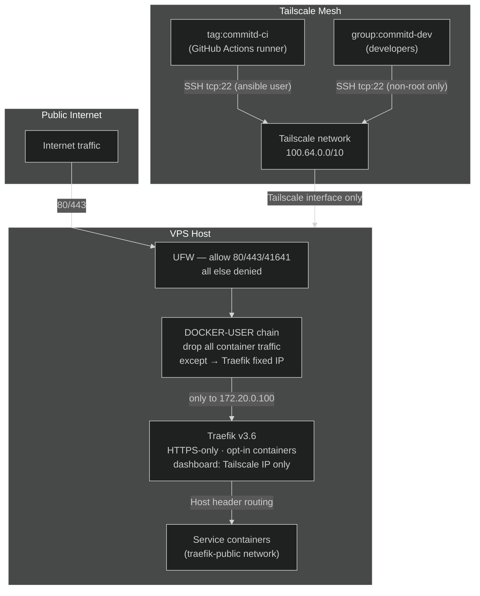

A freshly provisioned VPS with Docker has three problems out of the box: SSH listens on `0.0.0.0:22` with password auth
on, Docker bypasses UFW by writing directly to `iptables` (so published ports are public regardless of firewall rules),
and any reverse proxy dashboard is one bad label from being internet-accessible.

This documents few essential security measures for a VPS, automated with Ansible and GitHub Actions.

---

## The Model

The aim was least-privilege access at every layer — no single misconfiguration should be enough to expose management
interfaces or bypass the proxy.



Five layers, each compensating for the limits of the one above it:

1. **Tailscale** — zero-trust mesh VPN; all management traffic over it
2. **SSH hardening** — sshd bound to the Tailscale interface, no passwords, no root
3. **UFW** — host firewall; public internet sees only 80, 443, 41641/udp
4. **Docker / DOCKER-USER chain** — iptables rule that limits container exposure to Traefik's fixed IP
5. **Traefik** — reverse proxy; HTTPS-only, containers opt-in via labels, dashboard IP-allowlisted

---

## Layer 1: Tailscale

The instinctive response to "harden SSH" is fail2ban and key-only auth. That still leaves port 22 publicly visible —
fingerprintable, bruteforceable at the protocol level, and dependent on the host's own auth config being correct.

Tailscale changes the threat model. Instead of hardening a public port, the port isn't reachable from the public
internet at all. Management traffic enters only through the private [WireGuard](https://www.wireguard.com/) mesh,
authenticated at the Tailscale identity layer before it touches sshd.

Access control lives in the [ACL policy](https://tailscale.com/kb/1018/acls). CI runners (`tag:commitd-ci`) can reach
the server on `tcp:22` as the `ansible` user only. Developers (`group:commitd-dev`) can SSH as non-root only — no
privilege escalation through SSH. The tags are assigned at bootstrap; they cannot be self-assigned by nodes.

```json
"ssh": [
  { "action": "accept", "src": ["tag:commitd-ci"],
    "dst": ["tag:commitd-server"], "users": ["ansible"] },
  { "action": "accept", "src": ["group:commitd-dev"],
    "dst": ["tag:commitd-server"], "users": ["autogroup:nonroot"] }
]
```

The tradeoff is a hard dependency on Tailscale's control plane. If the coordination server is unreachable, new nodes
cannot join the tailnet. In practice, Tailscale's direct WireGuard connections survive control plane outages once
established — but the bootstrap path is gated behind it.

---

## Layer 2: SSH Hardening

Even with Tailscale in front, sshd still defaults to listening on all interfaces. A misconfigured UFW rule, a second
NIC, or a future network change could expose it. The fix is explicit: bind sshd to the Tailscale IP at the daemon level.

A single drop-in file deployed to `/etc/ssh/sshd_config.d/99-hardening.conf`:

```
ListenAddress {{ tailscale_ip }}
PermitRootLogin no
PasswordAuthentication no
PubkeyAuthentication yes
```

The Tailscale IP is resolved at Ansible runtime (`tailscale ip -4`) and templated in. This means the binding survives
reboots and Tailscale IP changes — though the playbook must be re-run if the IP changes. No hardcoded addresses.

The security playbook also guards against running over a non-Tailscale connection: it asserts that `ansible_host`
matches `^100\.` or ends in `.ts.net` before any tasks execute. Running it accidentally over the public IP before sshd
is locked down would lock you out.

---

## Layer 3: UFW

UFW on a Docker host has a [well-known problem](https://docs.docker.com/engine/network/packet-filtering-firewalls/):
Docker adds its own `PREROUTING` and `FORWARD` rules to iptables directly, bypassing UFW's `INPUT` chain. A container
with `ports: "8080:8080"` is publicly reachable on port 8080 regardless of UFW rules.

The common advice is `DOCKER_OPTS=--iptables=false`, but that breaks container networking entirely. I used the
`DOCKER-USER` chain instead — Docker explicitly hooks it and leaves it empty for operators to populate.

UFW itself is minimal:

```
DEFAULT_FORWARD_POLICY="ACCEPT"   # Docker container egress
net.ipv4.ip_forward=1             # sysctl

allow 80/tcp    # HTTP → Traefik
allow 443/tcp   # HTTPS → Traefik
allow 41641/udp # Tailscale P2P
allow in on tailscale0  # all Tailscale traffic
deny (default incoming)
```

Port 22 is not opened. SSH reaches the host through `tailscale0`, which is allowed wholesale.

`DEFAULT_FORWARD_POLICY=ACCEPT` is required — without it, UFW's default FORWARD deny breaks container-to-container
routing. This is a common misconfiguration that silently breaks Docker networking after UFW is enabled.

---

## Layer 4: Docker / DOCKER-USER Chain

Even with UFW correct, Docker's NAT rules expose published ports. The DOCKER-USER chain addresses this — Docker
processes it before its own rules on every forwarded packet.

The rules installed via `/etc/ufw/after.rules`:

```
*filter
:DOCKER-USER - [0:0]
-A DOCKER-USER -m conntrack --ctstate RELATED,ESTABLISHED -j ACCEPT
-A DOCKER-USER -i eth0 -d 172.20.0.100 -j ACCEPT
-A DOCKER-USER -i eth0 -j DROP
COMMIT
```

The logic: allow established connections (return traffic), allow new traffic on the public interface but only if
destined for `172.20.0.100` — Traefik's fixed IP on the `traefik-public` network — and drop everything else. A service
with `ports: "9000:9000"` is unreachable from the public interface even though Docker has created the NAT rule. The only
path in is through Traefik.

The fixed IP is load-bearing. Traefik is assigned `172.20.0.100` deterministically at container creation. If it changed
dynamically, the DOCKER-USER rule would have to be updated. A small tradeoff: a little rigidity in exchange for a rule
that can be stated in three lines.

---

## Layer 5: Traefik

Docker's container-discovery model defaults to `exposedbydefault=true`, which means every container with a running
service gets a route. That's the wrong default for a multi-tenant host.

Traefik is started with `--providers.docker.exposedbydefault=false`. Containers are invisible to Traefik unless they
carry `traefik.enable=true`. This makes exposure deliberate and auditable from the container's own labels rather than
Traefik config.

A few other specifics worth calling out:

**Wildcard TLS via Cloudflare DNS-01.** Rather than per-service certificates, a single wildcard cert covers
`*.commit-d.com`. This requires Cloudflare API credentials at Traefik startup and
[DNS-01 challenge](https://letsencrypt.org/docs/challenge-types/#dns-01-challenge) validation — no HTTP challenge, no
port 80 exposure required for cert issuance. `acme.json` is created at `0600`; anything more permissive leaks private
key material.

**Dashboard behind Tailscale allowlist.** The dashboard DNS A record points to the Tailscale IP, not the public IP. A
`tailscale-only` middleware restricts access to `100.64.0.0/10`. Both guards together: even if someone resolves the
dashboard hostname to the public IP somehow, the `ipallowlist` middleware blocks the request at Traefik.

```yaml
traefik.http.middlewares.tailscale-only.ipallowlist.sourcerange: '100.64.0.0/10'
traefik.http.routers.traefik-secure.middlewares: 'tailscale-only'
```

**Docker socket read-only.** The socket is mounted `:ro`. Traefik only needs to read container labels — write access to
the Docker socket is effectively root on the host.

---

## Automation

Three Ansible playbooks run in sequence via a single GitHub Actions workflow (`Setup VPS`):

1. **setup-base** — installs Docker CE, creates the `traefik-public` network with a fixed subnet
2. **setup-security** — UFW rules, DOCKER-USER chain, sshd drop-in, fail2ban
3. **setup-traefik** — Traefik container, Cloudflare DNS A record, waits for health check

All playbooks are idempotent. Re-running them converges the host to the desired state without side effects. The security
playbook's preflight assertion (Tailscale IP check) means it cannot accidentally run over the public interface — if you
try, it fails fast before touching any config.

The one-time manual step is bootstrap: SSH to the host with the root password, run `bootstrap.sh`, which installs
Tailscale, joins the tailnet as `tag:commitd-server`, and prints the Tailscale IP. After that, all automation runs over
Tailscale. The root password is effectively retired from the workflow.

Secrets (Cloudflare API token, Tailscale OAuth credentials) live in GitHub Actions secrets. The VPS host is referenced
by its Tailscale IP, not the public IP, so CI runners join the tailnet ephemerally via OAuth and connect directly.

---

## What This Doesn't Cover

This setup handles network exposure and access control. It does not address:

- **Runtime container scanning** — no Falco, no syscall auditing. A compromised container has full access to the
  `traefik-public` network.
- **Log shipping** — access logs stay on the host. No SIEM, no alerting on anomalous patterns.
- **WAF** — Traefik has no application-layer filtering. SQL injection, path traversal, and similar attacks reach the
  application.
- **Secret rotation** — Cloudflare and Tailscale credentials are static. There is no automated rotation or expiry
  enforcement.
- **Immutable infrastructure** — the host is mutable and stateful. A compromised host cannot be automatically detected
  and replaced.

These are real gaps, not theoretical ones. For the current scale, they are acceptable tradeoffs.

---

## Verification

I verified this by testing from the network, not just reviewing config. A simple script checks each layer from an
external machine:

```bash
# SSH blocked on public interface
nc -zv <PUBLIC_IP> 22

# Web ports open
curl -s -o /dev/null -w "%{http_code}" http://<PUBLIC_IP>

# Sensitive ports blocked (Docker-published services)
nc -zv <PUBLIC_IP> 8080

# Tailscale P2P port open
nc -zuv <PUBLIC_IP> 41641

# HTTP → HTTPS redirect
curl -I http://<DOMAIN>

# SSH reachable via Tailscale
ssh -o StrictHostKeyChecking=no ansible@<TAILSCALE_IP> 'echo ok'
```

The DOCKER-USER chain is the most important to verify empirically. It is easy to get wrong — conntrack ordering,
interface names, rule position relative to Docker's own rules all matter. Config review is insufficient; you need to
confirm that a published port on a non-Traefik container is actually unreachable from a machine outside the tailnet.

---

## Further Reading

- [Docker packet filtering and firewalls](https://docs.docker.com/engine/network/packet-filtering-firewalls/) — official
  Docker docs on the DOCKER-USER chain and why UFW alone is insufficient
- [Tailscale ACLs](https://tailscale.com/kb/1018/acls) — tag-based access control and SSH rules
- [Tailscale SSH](https://tailscale.com/kb/1193/tailscale-ssh) — how Tailscale SSH works vs traditional sshd
- [Mozilla OpenSSH guidelines](https://infosec.mozilla.org/guidelines/openssh) — sshd hardening reference; what I used
  to cross-check the drop-in config
- [Traefik Docker provider](https://doc.traefik.io/traefik/providers/docker/) — `exposedbydefault`, label-based routing
- [Let's Encrypt DNS-01 challenge](https://letsencrypt.org/docs/challenge-types/#dns-01-challenge) — why DNS-01 over
  HTTP-01 for wildcard certs
- [WireGuard](https://www.wireguard.com/) — the protocol underlying Tailscale

---
